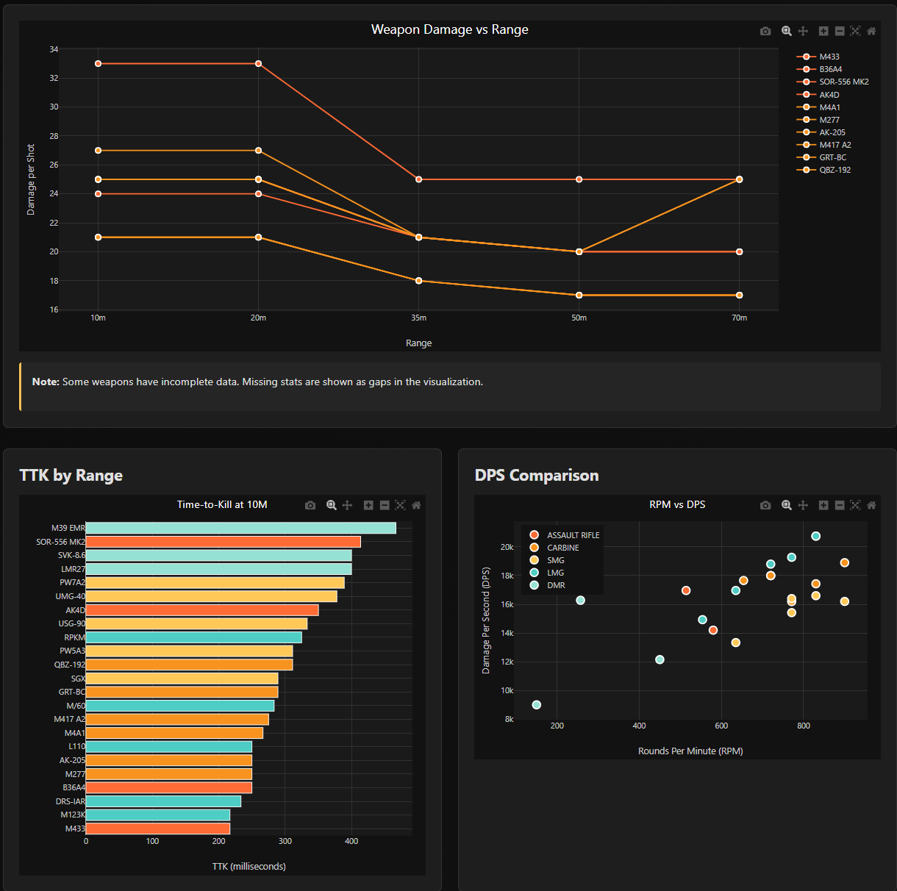

# 🎯 Battlefield 6 - Time-to-Kill (TTK) Visualization

[](https://opensource.org/licenses/MIT)
[](https://henryabraham52.github.io/BF6_TTK/)
[](CONTRIBUTING.md)

An interactive web-based visualization tool for analyzing Battlefield 6 weapon statistics, focusing on Time-to-Kill (TTK) metrics across different ranges and weapon types.



## 🌟 Features

- **📊 Interactive Charts** - Built with Plotly.js for smooth, responsive visualizations
- **🔍 Multi-Weapon Comparison** - Compare damage, TTK, and DPS across all weapon types
- **📈 Range Analysis** - View weapon performance at 10m, 20m, 35m, 50m, and 70m
- **🎨 Dark/Light Themes** - Toggle between themes with persistent preference
- **📱 Responsive Design** - Works seamlessly on desktop, tablet, and mobile
- **💾 Data Export** - Download filtered data as CSV
- **🔎 Advanced Filtering** - Filter by weapon type, range, and search terms
- **📏 TTK Calculator** - Automatic Time-to-Kill calculations based on damage and RPM

## 🚀 Live Demo

Visit the live application: **[https://henryabraham52.github.io/BF6_TTK/](https://henryabraham52.github.io/BF6_TTK/)**

## 📸 Screenshots

### Damage vs Range Chart
Interactive line chart showing weapon damage drop-off across all ranges.

### TTK Comparison
Bar chart comparing Time-to-Kill values for quick weapon selection.

### Weapon Statistics Table
Sortable, searchable table with complete weapon data.

## 🎮 What is Time-to-Kill (TTK)?

Time-to-Kill (TTK) represents the time required to eliminate an enemy player, assuming:
- All shots hit the target
- No headshot multipliers
- Standard player health (100 HP)
- No armor or damage reduction

### TTK Formula

```javascript
const shotsToKill = Math.ceil(100 / damagePerShot);
const timeBetweenShots = 60000 / rpm;
const ttk = (shotsToKill - 1) * timeBetweenShots;
```

**Example:** M433 at 10m
- Damage: 25
- RPM: 830
- Shots to kill: ceil(100/25) = 4
- Time between shots: 60000/830 = 72.3ms
- **TTK: (4-1) × 72.3 = 216.9ms**

## 📁 Project Structure

```
BF6_TTK/
├── index.html              # Main application page
├── css/
│   └── style.css           # Styles with Battlefield theme
├── js/
│   ├── main.js             # Application initialization
│   ├── data.js             # Data loading and processing
│   ├── charts.js           # Plotly.js chart generation
│   └── utils.js            # Utility functions (TTK calc, etc.)
├── data/
│   └── ttk.csv             # Weapon statistics database
├── .github/
│   └── ISSUE_TEMPLATE/     # Issue templates
├── README.md               # This file
├── CONTRIBUTING.md         # Contribution guidelines
├── CODE_OF_CONDUCT.md      # Community standards
├── LICENSE                 # MIT License
└── CLAUDE.md               # Project context for AI assistance
```

## 🛠️ Technology Stack

| Technology | Purpose |
|------------|---------|
| **Plotly.js** | Interactive charting library |
| **Papa Parse** | CSV parsing |
| **Vanilla JavaScript** | Core application logic |
| **CSS Grid/Flexbox** | Responsive layout |
| **GitHub Pages** | Static site hosting |

### Why These Technologies?

- ✅ **100% Client-Side** - No backend required, perfect for GitHub Pages
- ✅ **No Build Process** - Simple development and deployment
- ✅ **Fast & Lightweight** - Minimal dependencies
- ✅ **Highly Interactive** - Smooth hover, zoom, and pan capabilities

## 🚀 Getting Started

### Prerequisites

No installation required! This is a static website that runs entirely in the browser.

### Local Development

1. **Clone the repository**
   ```bash
   git clone https://github.com/henryabraham52/BF6_TTK.git
   cd BF6_TTK
   ```

2. **Start a local server**

   Using Python 3:
   ```bash
   python -m http.server 8000
   ```

   Using Node.js:
   ```bash
   npx serve
   ```

   Using PHP:
   ```bash
   php -S localhost:8000
   ```

3. **Open in browser**
   ```
   http://localhost:8000
   ```

### Deployment to GitHub Pages

1. Push your code to GitHub
2. Go to **Settings → Pages**
3. Under **Source**, select **Deploy from branch**
4. Select **master** branch and **/ (root)** folder
5. Click **Save**
6. Your site will be live at `https://henryabraham52.github.io/BF6_TTK/`

## 📊 Data Structure

The weapon data is stored in `data/ttk.csv`:

```csv
Weapon Type,Weapon,10M,20M,35M,50M,70M,RPM,DPS,ADS,Precision,Control
ASSAULT RIFLE,M433,25,25,20,20,20,830,346,250,20,41
CARBINE,M4A1,21,21,18,17,17,900,315,200,25,40
```

### Fields

| Field | Description |
|-------|-------------|
| `Weapon Type` | Category (Assault Rifle, Carbine, SMG, LMG, DMR, Sniper Rifle, Shotgun, Pistol) |
| `Weapon` | Weapon name |
| `10M - 70M` | Damage at specific ranges |
| `RPM` | Rounds per minute (fire rate) |
| `DPS` | Damage per second |
| `ADS` | Aim down sights time (milliseconds) |
| `Precision` | Hipfire precision score (0–100) |
| `Control` | Recoil control score (0–100) |

## 🤝 Contributing

We welcome contributions from the Battlefield community! There are many ways to help:

### 🎯 How to Contribute

1. **Add Missing Weapon Data** - Help complete the database
2. **Verify Existing Data** - Confirm accuracy of stats
3. **Report Bugs** - [Create an issue](https://github.com/henryabraham52/BF6_TTK/issues/new?template=bug_report.md)
4. **Suggest Features** - [Request a feature](https://github.com/henryabraham52/BF6_TTK/issues/new?template=feature_request.md)
5. **Improve Code** - Submit pull requests

### Quick Start Guide

1. Fork the repository
2. Create a feature branch (`git checkout -b feature/AmazingFeature`)
3. Make your changes
4. Commit your changes (`git commit -m 'Add some AmazingFeature'`)
5. Push to the branch (`git push origin feature/AmazingFeature`)
6. Open a Pull Request

**See [CONTRIBUTING.md](CONTRIBUTING.md) for detailed guidelines.**

## 📈 Current Data Status

| Status | Count | Percentage |
|--------|-------|-----------|
| ✅ Complete Weapons | 45 | 100% |
| ⚠️ Incomplete Weapons | 0 | 0% |
| **Total** | **45** | **100%** |

**🎉 All weapons now have complete data!** The database includes all weapon types with full statistics across all ranges.

## 🎨 Features Roadmap

### Current Version (v1.0)
- [x] Damage vs Range visualization
- [x] TTK comparison charts
- [x] RPM vs DPS scatter plot
- [x] Interactive filtering
- [x] Dark/Light theme toggle
- [x] Responsive design
- [x] Data export functionality

### Planned Features (v2.0)
- [ ] Weapon attachments impact
- [ ] Headshot multiplier calculations
- [ ] Recoil pattern visualizations
- [ ] Magazine size and reload time data
- [ ] Meta analysis (best weapons per range/role)
- [ ] User-uploaded custom data
- [ ] Loadout builder
- [ ] Comparison table view

**Vote on features or suggest new ones in [Discussions](https://github.com/henryabraham52/BF6_TTK/discussions)!**

## 🐛 Known Issues

- DPS values may not reflect real-world performance due to recoil
- No headshot multiplier calculations yet
- TTK calculations assume perfect accuracy (all shots hit)

See the [Issues](https://github.com/henryabraham52/BF6_TTK/issues) page for full list and progress.

## 📝 License

This project is licensed under the MIT License - see the [LICENSE](LICENSE) file for details.

## 🙏 Acknowledgments

- **Battlefield Community** - For testing and data contributions
- **EA/DICE** - For creating Battlefield 6
- **Plotly.js Team** - For the excellent charting library
- **All Contributors** - Thank you for your valuable input!

## 📧 Contact & Support

- **Issues & Bugs**: [GitHub Issues](https://github.com/henryabraham52/BF6_TTK/issues)
- **Feature Requests**: [GitHub Discussions](https://github.com/henryabraham52/BF6_TTK/discussions)
- **General Questions**: Open a [Discussion](https://github.com/henryabraham52/BF6_TTK/discussions/new)

## ⚠️ Disclaimer

This is a fan-made community project and is **not affiliated with or endorsed by EA or DICE**. All weapon statistics are community-sourced and may contain inaccuracies. Use for informational purposes only.

## 🌟 Star History

If you find this project useful, please consider giving it a ⭐ on GitHub!

[](https://star-history.com/#henryabraham52/BF6_TTK&Date)

---

**Built with ❤️ by the Battlefield Community**

[🔝 Back to Top](#-battlefield-6---time-to-kill-ttk-visualization)
